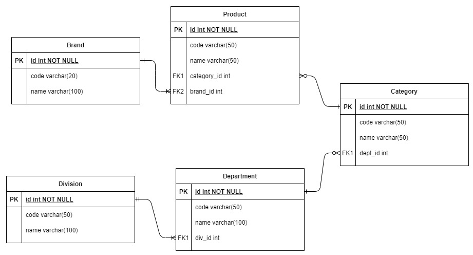

Junior Data Engineer Questions<a name="TOP"></a>
==============
 


Question 1. Pages Table
------------------

idnum    |page_id   |from_userid
---------|----------|--------------
1        |5         |2             
2        |6         |3             
4        |7         |null          
null     |0         |null          

 

Question 2: 
--------------------------------

**read plain text and convert to csv in python**
```

txt_list = []
with open('plain.txt','r') as file:
    txt_list+=file.readlines()

data_list = [each.replace('\n','') for each in txt_list if each != '\n']
record_list = []
for each in data_list:
    record_list.append([each[:3],each[3:11],each[11:14],each[14:]])
print(record_list)

---

> output: [['001', '20210101', 'VIC', 'MELBOURNE'],
           ['002', '20210101', 'NSW', 'SYDNEY'],
           ['003', '20201101', 'TAS', 'HOBART'],
           ['004', '20210101', 'QLD', 'BRISBANE'],
           ['005', '20210101', 'SA ', 'ADELAIDE'],
           ['006', '20210101', 'WA ', 'PERTH'],
           ['007', '20210101', 'ACT', 'CANBERRA'],
           ['008', '20210201', 'WA ', 'PERTH'],
           ['009', '20210201', 'NT ', 'DARWIN']]
           
---
```

**save data into csv (python)**

```
import csv

with open("output.csv", "w", newlines = '') as f:
    writer = csv.writer(f)
    writer.writerows(record_list)
```


**create table and load csv into table in postgresql**

```
create table fixedlength_file (ID integer,
                               Creation_date date,
                               State1 varchar(3),
                               City varchar(10))

COPY fiexedlength_file(ID, Creation_date, State1, City)
FROM 'plain.csv'
DELIMITER ','

```


Question 3: 
---------------------
Load a plain text file but with pipe delimited (|):
```

COPY fixedlength_file FROM 'plain.txt' (DELIMITER('|'))

```
 

Question 4: 
--------------------

Write a query to get a list of all fields but with unique city based on highest creation_date in table ‘fixedlength_file’ from above.

```

select distinct(city),max(creation_Date) from fixedlength_file group by city

```
 

Question 5: Table Join
--------------------

_a. select t1.id, t1.name, t2.title from table1 t1 left join table2 t2 on t1.id = t2.id;_

id    |name    |title       
------|--------|---------
1     |Chris   |CEO      
2     |Rob     |CFO      
3     |Mark    |CTO      
4     |Matt    |CRO      
5     |Fletch  |Director  
5     |Rad     |Director
5     |Andrew  |Director


_b. select t1.id, t1.name, t2.title from table1 t1 right join table2 t2 on t1.id = t2.id;_

id    |name    |title       
------|--------|---------
1     |Chris   |CEO      
2     |Rob     |CFO      
3     |Mark    |CTO      
4     |Matt    |CRO      
5     |Fletch  |Director  
5     |Rad     |Director
5     |Andrew  |Director
null  |null    |DBA      
null  |null    |Engineer
null  |null    |Analyst 

_c. select t1.id, t1.name, t2.title from table1 t1 inner join table2 t2 on t1.id = t2.id;_

id    |name    |title       
------|--------|---------
1     |Chris   |CEO      
2     |Rob     |CFO      
3     |Mark    |CTO      
4     |Matt    |CRO      
5     |Fletch  |Director  
5     |Rad     |Director
5     |Andrew  |Director
null  |null    |DBA      
null  |null    |Engineer
null  |null    |Analyst 

_d. select t1.id, t1.name, t2.title from table1 t1 full outer join table2 t2 on t1.id = t2.id;_

id    |name    |title       
------|--------|---------
1     |Chris   |CEO      
2     |Rob     |CFO      
3     |Mark    |CTO      
4     |Matt    |CRO      
5     |Fletch  |Director  
5     |Rad     |Director
5     |Andrew  |Director
null  |null    |DBA      
null  |null    |Engineer
null  |null    |Analyst 


Question 6. Wrangling
----------------------

**Potential problems:**
- in-consistency birthday format: should change the birthday of third row to '12-22-1990'
- comma delimiter to load PostalAddress - can change the ',' to other signal letter like '|' to avoid split the address field into seperate values.


Question 7. Build Query
------------------------


_a. Write a query to get total amount based on year and month of date._

```

SELECT TO_CHAR(date,'Mon') as mon,
       EXTRACT(year from date) as yyyy,
       SUM("amount") as "Amount"
FROM price
GROUP BY 1,2

```

_b. Write a query to display top 5 records based on id in descending order._

```

select * from price order by id desc limit 5

```

_c. Write a query to delete the records where the month is later than JULY._

```

DELETE FROM (SELECT EXTRACT(month from date) as mm, *
FROM price) a
WHERE a.mm > 7

```


Question 8:  Add a column(sequence_num) ;auto increased.
---------------------


```

ALTER TABLE price ADD COLUMN sequece_num SERIAL;

```
 

Question 9: ER diagram
--------------------
 

 

 

Question 10: 
-------------------


**Change the table properties**

```

ALTER TABLE table_name
    ALTER COLUMN column_name TYPE VARCHAR(13);

```

